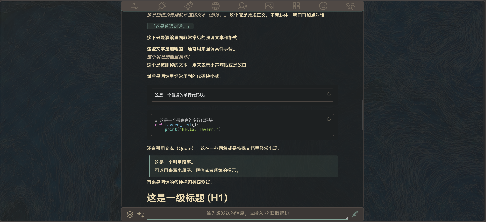
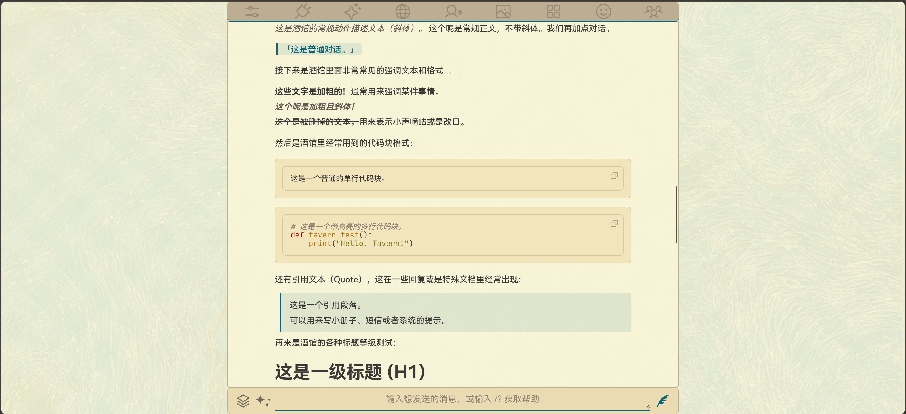

# Gruvbox Harmony

SillyTavern 主题包。[Gruvbox](https://github.com/morhetz/gruvbox) 配色 + HarmonyOS Sans SC 字体，正式 20 套 + 测试 2 套。

## 预览

| 暗色（Harmony-Blue） | 浅色（Blue-Light） |
|---|---|
|  |  |

更多配色与移动端预览见 [screenshots/](screenshots/)。

## 系列

| 系列 | 目录 | 说明 |
|---|---|---|
| Harmony | `themes/harmony/` | 暗色主力，图标替换为 Phosphor 线条风格 |
| Light | `themes/light/` | 浅色版（Gruvbox 官方 light 色板 + faded 主色） |
| Material | `themes/material/` | gruvbox-material 变体（前景降压 + accent 降饱和），5 暗 5 亮 |
| Classic（测试） | `test-themes/` | mode1 传统小圆头布局锁定版（暗/亮各一），**不进发布包** |

> Lite / Online 系列已停维，大卡改造前快照归档在 `archive/lite/`、`archive/online/`。

## 头像样式开关

每个主题 CSS 里 `#chat { --avatar-mode: 0 }` 可切换头像形态（改完需切一次主题生效）：

- `0` = 电影大卡：顶部居中 16:9 大图 + 相框板 + 海报式信息行（默认）
- `1` = 传统小圆头像：左上圆形小头，名字/计数器在下方

模板里头像相关的双态尺寸统一用 `dual("大卡值", "小圆值")` 函数写（编译为运行时 calc），改布局时照此写，别手写算式。

## 配色（明暗对称五色）

暗色系用 bright 高亮色、Light 系用 faded 深色——同名不同值，浅底上才压得住：

| 配色 | 暗色系 | Light 系 | 色源 |
|------|--------|----------|------|
| Blue | `#83a598` | `#076678` | 官方 bright_blue / faded_blue |
| Green | `#b8bb26` | `#79740e` | 官方 bright_green / faded_green |
| Orange | `#fe8019` | `#af3a03` | 官方 bright_orange / faded_orange |
| Purple | `#b16286` | `#8f3f71` | 官方 neutral_purple / faded_purple |
| Violet | `#9966cc` | `#9966cc` | 自调色（Amethyst） |

Material 系列配色独立：暗色用 gruvbox-material 官方色板（前景 `#d4be98`、背景 `#282828`、accent 降饱和 `#7daea3`/`#a9b665`/`#e78a4e`/`#d3869b`），亮色用 faded 深色版 + 米白底。

基础色（背景/文字/边框等）明细见 [docs/Gruvbox-Harmony-docs.md](docs/Gruvbox-Harmony-docs.md)。

## 安装

1. 下载对应系列目录下的 `.json` 文件
2. SillyTavern → 用户设置 → UI 主题 → 导入主题文件
3. 下拉框选中即生效

## 说明

- 字体经 jsdelivr CDN 加载，网络不通时的镜像方案见 [docs/CDN-MIRRORS.md](docs/CDN-MIRRORS.md)，换字体方法见 [docs/FONT-GUIDE.md](docs/FONT-GUIDE.md)
- 桌面 Chrome/Edge 135+ 的下拉弹层为主题化渲染；移动端与其他浏览器保持系统原生弹层
- 历史版本打包在 `releases/`，更新记录在 `changelogs/`（打包只含 `themes/`，不含测试主题与归档）

## 二改

欢迎。[MIT 协议](LICENSE)，保留出处即可。

### 源层结构（想动手改的看这里）

`themes/` 下的 20 套 JSON 是**构建产物**，不要直接改它们。真身在 `src/`：

```
src/
├── _base-dark.scss    暗色布局模板（10套共用）
├── _base-light.scss   亮色布局模板（10套共用）
└── tokens/            每套主题一个颜色令牌文件
scripts/
├── build.js           编译+对账+包进JSON
└── migrate.js         一次性迁移脚本（已完成使命，留作参考）
```

改 1 处 = 改 20 套：颜色改 tokens，布局改模板。

### 构建

```bash
npm install                 # 首次，装 sass
node scripts/build.js       # 构建并写入 themes/（语义不一致会拒绝写入，防手滑）
node scripts/build.js --dry      # 只校验不写入
node scripts/build.js --only 主题名  # 只构建某一套
node scripts/build.js --force    # 有意变更时跳过对账
```

### 改配色（最简单的二创）

只需改 `src/tokens/Gruvbox-xxx.scss` 里的颜色值，重跑构建。令牌已语义化命名，暗色每套 7 个（accent + 光晕梯度），亮色每套 22 个，每个都有中文注释，例如：

```scss
$accent: "#076678";       // 主题accent
$icon-color: "3c3836";    // 图标SVG填色
$toast-error: "#fb4934";  // toast错误色
```

令牌是带引号的字符串，引号不要丢——防 sass 把颜色值规范化改名。

### 换字体（一次配置永久生效）

把 `src/_fonts.scss` 复制为 `src/_fonts-local.scss`（已 gitignore）再改里面的 @import 和 --font-* 变量，构建即生效；`git pull` 拉新版不会覆盖它。详见 [docs/FONT-GUIDE.md](docs/FONT-GUIDE.md) 第一节。

### 新增一套配色主题

1. 复制一个现有 token 文件改名，改里面的 `$theme-name` 和颜色
2. 在 `scripts/build.js` 的 `GROUPS` 对应组里加上主题名
3. 在 `themes/harmony`、`themes/light` 或 `themes/material` 里放一个同名 JSON（可复制现有的，脚本只会重写其中的 `custom_css`）。注意把 `quote_text_color` 等颜色字段也改成新配色——酒馆靠它注入 accent
4. 令牌文件里还要加 5 行 `$tint-NN`（accent 的半透明梯度，hover 光晕用）：从相邻主题抄一份，把 rgb 换成新 accent 即可
5. 跑 `node scripts/build.js`

### 两个已踩过的坑

- **filter 过渡里别用 color-mix**：Chrome 不平滑插值，hover 光晕会"延迟突亮"。需要半透明 accent 用 `$tint-NN` 令牌（构建时预算好的 rgba）
- **属性选择器带引号值**（如 `[is_user="true"]`）和 **alpha=1 的 rgba**：构建脚本已用占位符旁路保护，模板里照常规写即可

## 配色溯源

- 基础配色（Harmony / Light）源自 [morhetz/gruvbox](https://github.com/morhetz/gruvbox)
- Material 变体源自 [sainnhe/gruvbox-material](https://github.com/sainnhe/gruvbox-material)（前景降压 + accent 降饱和，"soft contrast 护眼"）
